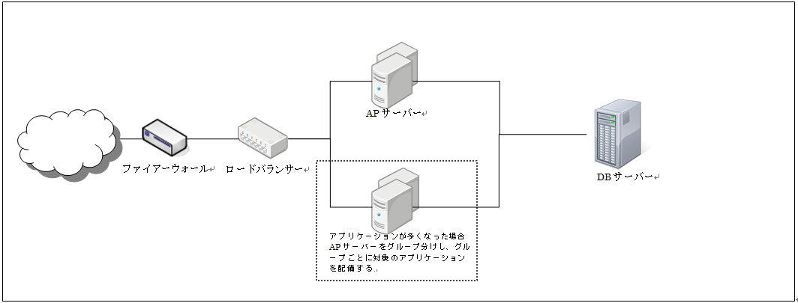

サーバー構成
==============
.. index::
   single: スケールアウト
   single: ステートフル
   single: sticky接続

**Handywedge** を使用したサーバー論理構成例を :numref:`fig-server-const` に示す 。

   サーバー論理構成例

+ アプリケーションの負荷のに伴い、アプリケーションサーバーをスケールすることが可能。
+ アプリケーションサーバーへの負荷分散はsticky接続のステートフルな構成とする。（オンメモリーセッションを前提とする場合）
+ アプリケーションサーバーの物理的限界を超えてしまう場合は、アプリケーションサーバーをグループ分けし負荷分散装置でアプリケーションサーバーグループに振り分ける。
