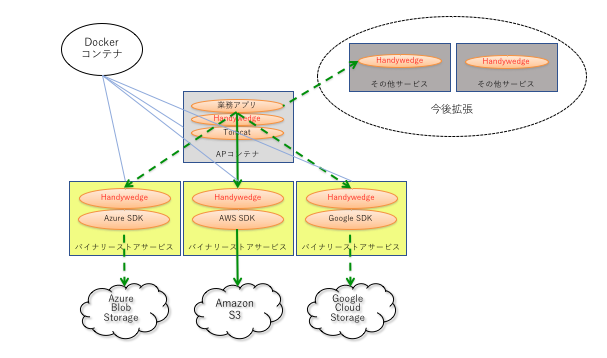

==============================
アプリケーション共通サービス
==============================

**Handywedge** が提供するサービス機能について記述する。

**Handywedge** のサービスはマイクロサービスとしてDockerコンテナを提供する。

マイクロサービスのイメージを :numref:`fig-microservice` に示す 。

  マイクロサービス

+ Dockerコンテナを切り替えることでプログラムの変更なしに連携サービスの切り替えが可能
+ マイクロサービスのAPIはRESTで提供されるためマイクロサービス単体でも利用可能
+ 今後連携サービスを拡張

.. toctree::
  :maxdepth: 2

  binarystore
